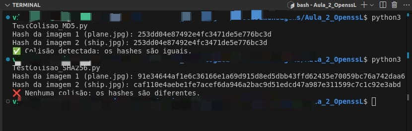

# 🔐 Comparação de Hash de Imagens com OpenSSL

Este projeto demonstra como verificar se duas imagens diferentes possuem **colisão de hash**, utilizando os algoritmos **MD5** e **SHA256** através do OpenSSL via Python.

---

## 📁 Estrutura de Pastas

```
Aula_2_CompararHash/
│
├── img/
│   ├── plane.jpg
│   └── ship.jpg
│
├── TestColisao_MD5.py
└── TestColisao_SHA256.py
```

## 📜 Requisitos

- Python 3 instalado
- OpenSSL instalado e acessível pelo terminal (verifique com `openssl version`)

---

## ⚙️ Como funciona?

Cada script calcula o **hash** de duas imagens (`plane.jpg` e `ship.jpg`) localizadas na pasta `img/`, usando o OpenSSL. Depois, os hashes são comparados para verificar se há colisão (mesmo hash para arquivos diferentes).

---

## ▶️ Como usar

1. **Acesse o diretório do projeto**:

```bash
cd Aula_2_CompararHash
```
1. **Execute o script de teste com MD5:**:

```bash
python3 TestColisao_MD5.py
```
1. **Execute o script de teste com SHA256:**:

```bash
python3 TestColisao_SHA256.py
```

##  Resultado no terminal

