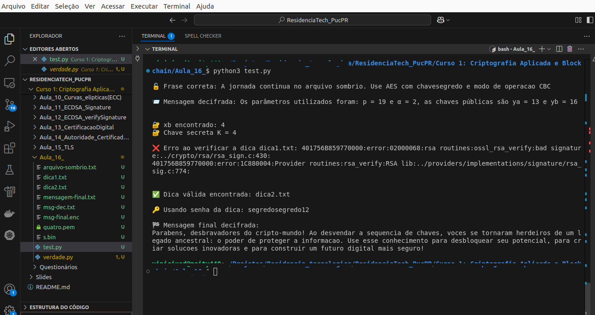

# 🔐 Desafio de Criptografia: Decifração e Verificação

Este repositório contém o script Python, que implementa um desafio de criptografia em cinco etapas. O script combina técnicas de decifração (Cifra de César, AES), troca de chaves Diffie-Hellman, verificação de assinaturas digitais e decifração final de uma mensagem criptografada. Ele utiliza as bibliotecas `subprocess`, `sympy`, `Crypto` e ferramentas como OpenSSL.

---

## 🧾 Funcionalidades

- 🔓 **Decifração com Cifra de César**: Decifra uma mensagem cifrada usando deslocamento fixo.
- 📨 **Decifração AES-256-CBC**: Decifra um arquivo cifrado com OpenSSL usando uma chave predefinida.
- 🔐 **Troca de Chaves Diffie-Hellman**: Calcula a chave secreta \( K \) usando logaritmo discreto.
- ✅ **Verificação de Assinatura Digital**: Valida assinaturas digitais em arquivos de dicas usando OpenSSL.
- 🏁 **Decifração Final com AES-CTR**: Decifra a mensagem final usando uma chave revelada por uma dica válida.

---

## 🛠️ Pré-requisitos

- Python 3.6 ou superior
- OpenSSL instalado e acessível via linha de comando
- Bibliotecas Python: `sympy`, `pycryptodome`

### Instalação

1. Instale as dependências Python:
   ```bash
   pip install sympy pycryptodome
   ```

2. Verifique se o OpenSSL está instalado:
   ```bash
   openssl version
   ```
   Caso não esteja instalado, instale-o conforme o sistema operacional:
   - **Ubuntu/Debian**: `sudo apt-get install openssl`
   - **macOS**: `brew install openssl`
   - **Windows**: Baixe e instale a partir do [site oficial do OpenSSL](https://www.openssl.org/).

3. Certifique-se de que os seguintes arquivos estão no mesmo diretório do script:
   - `arquivo-sombrio.txt`: Arquivo cifrado para o Passo 2
   - `quatro.pem`: Chave pública para verificação de assinaturas
   - `s.bin`: Arquivo de assinatura
   - `dica1.txt` e `dica2.txt`: Arquivos de dicas para verificação
   - `msg-final.enc`: Arquivo cifrado para o Passo 5

---

## 📜 Estrutura do Script

O script é dividido em cinco passos, cada um abordando uma tarefa criptográfica:

### Passo 1: Decifração com Cifra de César

- **Função**: `cifra_cesar(texto, deslocamento)` e `encontrar_frase_correta(texto_cifrado)`
- **Descrição**: Decifra uma mensagem codificada com Cifra de César usando um deslocamento fixo (hardcoded como 3).
- **Entrada**: Texto cifrado (`D mruqdgd frqwlqxd qr dutxlyr vrpeulr...`)
- **Saída**: Texto decifrado

```python
frase_correta = encontrar_frase_correta(texto_cifrado)
```

### Passo 2: Decifração AES-256-CBC com OpenSSL

- **Função**: `decifragem(arquivo_cifrado, chave)`
- **Descrição**: Usa OpenSSL para decifrar um arquivo (`arquivo-sombrio.txt`) com AES-256-CBC, utilizando a chave `"segredo"`.
- **Saída**: Arquivo decifrado (`msg-dec.txt`) e seu conteúdo exibido.

```python
decifragem('arquivo-sombrio.txt', 'segredo')
```

### Passo 3: Cálculo da Chave Diffie-Hellman

- **Descrição**: Calcula a chave secreta \( K \) usando o algoritmo Diffie-Hellman com logaritmo discreto.
- **Parâmetros**:
  - \( p = 19 \), \( \alpha = 2 \), \( y_a = 13 \), \( y_b = 16 \)
  - Calcula \( x_b \) via `discrete_log` e deriva \( K = y_a^{x_b} \mod p \)
- **Saída**: \( x_b \) e \( K \)

```python
xb = discrete_log(p, yb, alpha)
K = pow(ya, xb, p)
```

### Passo 4: Verificação de Assinatura Digital

- **Função**: `verificar_assinatura(arquivo_pub, assinatura, arquivo_dica)`
- **Descrição**: Verifica a validade de assinaturas digitais em dois arquivos de dicas (`dica1.txt` e `dica2.txt`) usando OpenSSL com a chave pública (`quatro.pem`) e a assinatura (`s.bin`).
- **Saída**: Identifica a dica válida.

```python
for dica in ["dica1.txt", "dica2.txt"]:
    if verificar_assinatura(arquivo_pub, assinatura, dica):
        dica_valida = dica
```

### Passo 5: Decifração Final com AES-CTR

- **Função**: `decifrar_msg_final_verdade(arquivo_cifrado, chave, arquivo_saida)`
- **Descrição**: Decifra o arquivo `msg-final.enc` usando AES no modo CTR com a chave revelada pela dica válida (`segredosegredo12`).
- **Saída**: Arquivo decifrado (`mensagem-final.txt`) e seu conteúdo exibido.

```python
decifrar_msg_final_verdade('msg-final.enc', 'segredosegredo12')
```

---

## 📁 Arquivos Necessários

- **Entrada**:
  - `arquivo-sombrio.txt`: Arquivo cifrado para o Passo 2
  - `quatro.pem`: Chave pública para verificação de assinaturas
  - `s.bin`: Assinatura digital
  - `dica1.txt` e `dica2.txt`: Arquivos de dicas
  - `msg-final.enc`: Arquivo cifrado para o Passo 5
- **Saída**:
  - `msg-dec.txt`: Arquivo decifrado do Passo 2
  - `mensagem-final.txt`: Arquivo decifrado do Passo 5

---

## 🧪 Como Executar

1. Certifique-se de que o OpenSSL e as bibliotecas Python estão instalados.
2. Coloque os arquivos de entrada (`arquivo-sombrio.txt`, `quatro.pem`, `s.bin`, `dica1.txt`, `dica2.txt`, `msg-final.enc`) no mesmo diretório do script.
3. Execute o script:

   ```bash
   python desafio_criptografia.py
   ```

O script executará todas as etapas sequencialmente, exibindo os resultados de cada passo.

---

## ✅ Exemplo de Saída




**Interpretação**:
- **Passo 1**: Exibe a frase decifrada com Cifra de César.
- **Passo 2**: Mostra o conteúdo do arquivo decifrado com AES-256-CBC.
- **Passo 3**: Calcula e exibe \( x_b \) e \( K \) do Diffie-Hellman.
- **Passo 4**: Identifica a dica válida (`dica2.txt`).
- **Passo 5**: Exibe a mensagem final decifrada com AES-CTR.

---

## 📝 Notas

- O deslocamento da Cifra de César está hardcoded como 3. Para maior flexibilidade, modifique a função `encontrar_frase_correta` para testar todos os deslocamentos ou usar análise de frequência.
- A chave do Passo 2 (`segredo`) e do Passo 5 (`segredosegredo12`) são predefinidas. Em cenários reais, use gerenciamento seguro de chaves.
- O script assume que os arquivos de entrada estão presentes e corretos. Certifique-se de que eles existem no diretório atual.
- O modo AES-CTR no Passo 5 usa um nonce (IV) de metade do tamanho do bloco AES, conforme especificado no script.
- Para uso em produção, adicione validações robustas para erros de arquivo, formato de chave e exceções.

---

## 🚀 Tecnologias Utilizadas

- **Linguagem**: Python
- **Bibliotecas**: `subprocess`, `sympy`, `pycryptodome`
- **Ferramentas**: OpenSSL
- **Algoritmos**: Cifra de César, AES (CBC e CTR), Diffie-Hellman, SHA-256

---

## 👨‍💻 Autor

**Vinicius D.**\
Desenvolvedor e entusiasta de criptografia e segurança.\
**Residência Tecnológica PUCPR 2025**

---

## 📄 Licença

Este projeto está licenciado sob a MIT License.