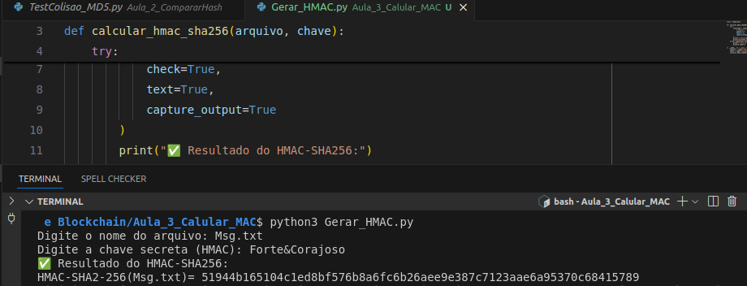

# 🔐 Gerador de HMAC com OpenSSL (Python + SHA-256)

Este script em Python executa um comando OpenSSL para gerar um HMAC (Hash-based Message Authentication Code) utilizando o algoritmo SHA-256. Ele é útil para verificar a **integridade** e **autenticidade** de arquivos.

---

## 📂 Como funciona

O script solicita dois dados do usuário via terminal:

1. 📄 **Nome do arquivo**: o arquivo que você deseja calcular o HMAC.
2. 🔑 **Chave secreta (HMAC)**: a chave utilizada na geração do código MAC.

Após receber os dados, o script executa o seguinte comando:

```bash
openssl dgst -hmac "chave" -sha256 nome-arquivo
```
## ▶️ Como usar
**Pré-requisitos**

Python 3 instalado

OpenSSL instalado no sistema (disponível por padrão na maioria dos sistemas Unix)

**Passo a passo**

1 - Salve o script como Gerar_HMAC.py

2- No terminal, execute:
```bash
python3 Gerar_HMAC.py
```
3- Digite o nome do arquivo (deve estar no mesmo diretório ou com caminho completo)

4- Digite a chave HMAC desejada

---
## 💡 Exemplo de uso

---
## 📌 Observações
* O script apenas calcula o HMAC; ele não salva o resultado em arquivo, a menos que você modifique para isso.

* É importante manter a chave em sigilo para garantir a segurança do HMAC.
---
## 🧠 Conceito: O que é um HMAC?
Um HMAC é uma função de autenticação que utiliza uma função hash criptográfica (neste caso, SHA-256) combinada com uma chave secreta. Ele é utilizado para garantir que:

📦 O conteúdo da mensagem não foi alterado (integridade)
✅ A mensagem foi enviada por alguém que conhece a chave (autenticidade)

