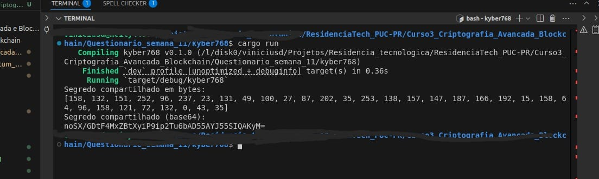

# Trabalho Prático - Semana 11

## Descrição

Dado os arquivos `ciphertext.b64` e `private_key.b64` disponíveis na página do curso, desenvolva um programa em **Go** para desencapsular o segredo compartilhado e exibi-lo em tela (ou seja, decifrar o texto cifrado). O algoritmo utilizado é o **Kyber768**, implementado por meio da biblioteca `liboqs-go`. Os arquivos fornecidos estão codificados em **base64**. O programa deve:

1. Carregar o texto cifrado e a chave privada.
2. Decifrar o texto cifrado.
3. Exibir o segredo compartilhado codificado em **base64** na saída padrão.

O código deve ser entregue e a saída deve ser o segredo compartilhado no formato **base64**.

## Observação

Uma implementação alternativa em **Rust** utilizando a biblioteca `liboqs-rust` está disponível. Para executá-la, siga os passos abaixo:

```bash
cd kyber768
cargo build
cargo run
```

